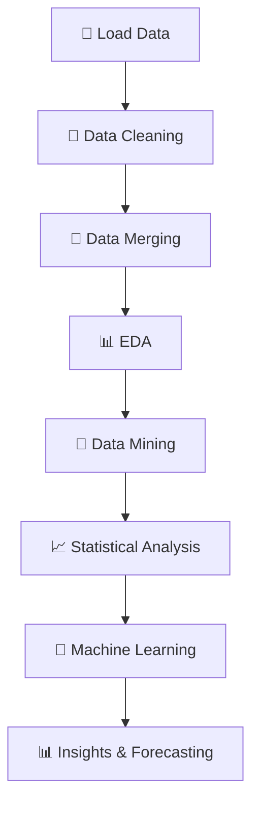

<div align="center">
  
  <br><br>
  
  
  
</div>

---

## <div align="center"><b style="color:#1E40AF">📊 Project Overview</b></div>

The **Cafe Sales Analytics & Demand Forecasting Pipeline** is a **comprehensive end-to-end data science project** that analyzes cafe transaction data (2012–2015) to extract insights, discover patterns, and predict future demand.

This project integrates:

* 📊 Exploratory Data Analysis (EDA)
* 🧠 Data Mining Techniques
* 🤖 Machine Learning Models
* 📈 Statistical Analysis

It provides **business-ready insights** for optimizing pricing, sales strategies, and customer behavior understanding.

<div align="center">
  
  
  
</div>

---

## ✨ **Key Features**

| Feature                | Description                               |
| ---------------------- | ----------------------------------------- |
| 📊 EDA                 | Data exploration and visualization        |
| 🧩 Clustering          | DBSCAN for customer behavior segmentation |
| 🛒 Association Rules   | Apriori + Lift analysis                   |
| 🔗 Sequential Patterns | PrefixSpan for behavior sequences         |
| 💰 Price Elasticity    | OLS regression analysis                   |
| 📈 Forecasting         | Demand prediction using regression        |
| 🧠 Classification      | Logistic regression model                 |

---

## 🖥️ **System Pipeline**



---

## 📊 **Datasets Overview**

| Dataset         | Records | Description                          |
| --------------- | ------- | ------------------------------------ |
| 📅 DateInfo     | 1,349   | Holidays, weekends, temperature      |
| 🧾 Transactions | 5,404   | Price, quantity, sales               |
| 🛍️ SellMeta    | 11      | Item metadata (BURGER, COFFEE, etc.) |
| 🔗 Merged Data  | 10,840  | Combined dataset                     |

---

## ⚙️ **Pipeline Breakdown**

### 1️⃣ Data Quality

* ✅ Clean datasets (92%–100%)
* ✅ No duplicates
* ✅ Date parsing completed

---

### 2️⃣ Exploratory Data Analysis

* 📊 Correlation heatmap
* 📉 Violin plots (price vs quantity)
* 📦 Distribution analysis
* 🔍 Feature relationships

---

### 3️⃣ Advanced Analytics

#### 🧩 Clustering (DBSCAN)

* Clusters: **40**
* Noise points: **4020 (37%)**
* Largest cluster: **900 records**

#### 🛒 Association Rules (Apriori)

* Rule: **Weekend → School Break**
* Lift: **1.05 (positive association)**

#### 🔗 Sequential Patterns (PrefixSpan)

* Patterns discovered: **1253**
* Example:

  * [New Year → BURGER]
  * [11.26 → COFFEE]

---

### 4️⃣ Statistical Analysis

#### 💰 Price Elasticity

* Elasticity: **2.19**
* 📉 1% ↑ price → 2.19% ↓ demand
  👉 Indicates **highly price-sensitive customers**

---

### 5️⃣ Predictive Modeling

#### 📈 Demand Forecasting (OLS)

* R²: **0.72**
* Significant predictors:

  * PRICE (negative impact)
  * WEEKEND
  * OUTDOOR seating

#### 🧠 Classification (Logistic Regression)

* Accuracy: **87.45%**
* Strong performance in category prediction

---

## 📈 **Key Insights**

```id="z81qkp"
🔥 Strong Relationships:
- PRICE ↔ SALES: Negative correlation (-0.76)

📉 Demand Behavior:
- Highly elastic demand (2.19)

📅 Business Patterns:
- Weekdays outperform weekends
- Indoor sales outperform outdoor

🎯 Special Events:
- New Year significantly impacts sales
```

---

## 🎨 **Visualizations Included**

* 📊 Correlation Heatmap
* 📉 Violin Plots
* 🔵 Bubble Chart (Price vs Quantity)
* 📦 Box-Cox Transformation Plots
* 📈 Regression Plots (OLS)
* 🤖 Logistic Sigmoid Curve
* 🔥 Confusion Matrix Heatmap

---

## 🔬 **Data Transformations**

* 📦 Box-Cox transformation (price, quantity, temperature)
* 📏 Z-score normalization
* 🧩 One-hot encoding (categorical features)
* 🔢 Label encoding

---

## 📊 **Performance Summary**

| Metric                  | Value  | Insight                 |
| ----------------------- | ------ | ----------------------- |
| R² (Demand Model)       | 0.72   | Strong predictive power |
| Price Elasticity        | 2.19   | Elastic demand          |
| Classification Accuracy | 87.45% | High performance        |
| Clusters                | 40     | Detailed segmentation   |
| Rules                   | 5+     | Actionable insights     |

---

## 🚀 **Quick Start**

```bash id="k2a9qp"
# Clone repository
git clone https://github.com/your-username/cafe-analytics.git
cd cafe-analytics
```

### 📦 Install Requirements

```bash id="0v2nqe"
pip install pandas numpy matplotlib seaborn scikit-learn mlxtend prefixspan statsmodels
```

### ▶️ Run Project

```bash id="9r8wbc"
# Jupyter Notebook
jupyter notebook cafe_analytics.ipynb

# OR Python script
python cafe_analysis.py
```

---

## 🧪 **Sample Output**

```id="d3n0qt"
Price Elasticity: 2.1856
DBSCAN Clusters: 40
Logistic Accuracy: 87.45%
OLS R²: 0.720
```

---

## ⚙️ **Customization**

```python id="6p4m8y"
# DBSCAN
eps = 0.5
min_samples = 50

# Apriori
min_support = 0.01
min_lift = 1.0
```

---

## 📂 **Project Structure**

```id="3t7kzl"
cafe-analytics/
│
├── DateInfo.csv
├── Cafe-Transaction-Store.csv
├── Cafe-Sell-Meta-Data.csv
├── cafe_analytics.ipynb
└── README.md
```

---

## 🔮 **Future Enhancements**

* 🤖 Deep Learning Forecasting (LSTM)
* 📊 Interactive Dashboards (Power BI / Streamlit)
* ☁️ Deployment (Cloud APIs)
* 🎯 Real-time Recommendation System
* 🧠 Advanced Feature Engineering

---

## 👩‍💻 **Author**

<div align="center">
  <a href="https://linkedin.com/in/nour-mohammed-614753278">
    
  </a>
  
</div>

---

## ❤️ **Acknowledgments**

<div align="center">
  
  <br>
  <sub>Built with ❤️ for Data Science, Business Analytics & Machine Learning</sub>
</div>

<div align="center">
  
</div>
